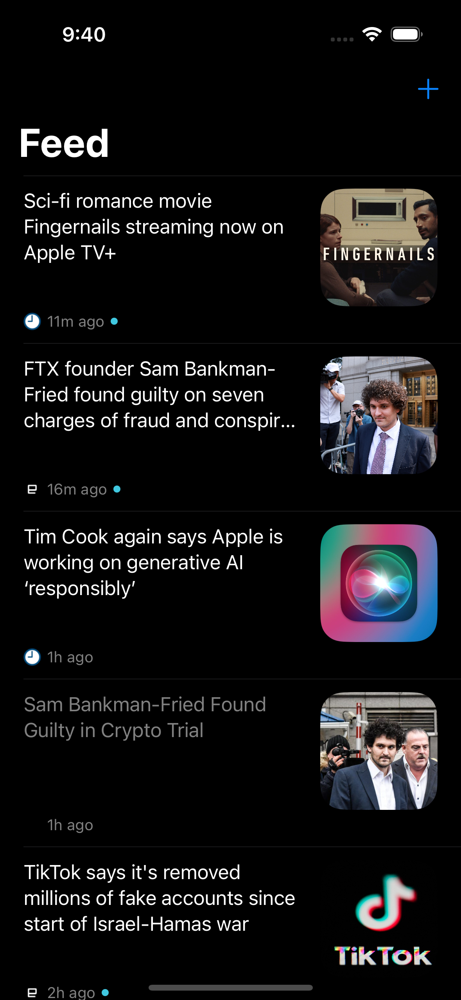
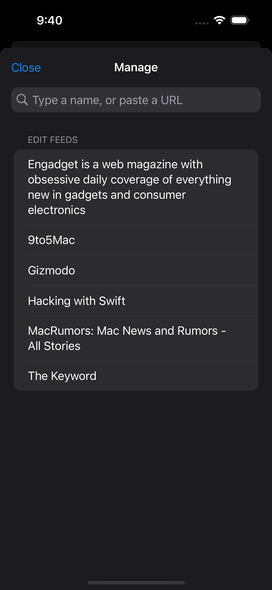

# Echo-iOS
 

A simple RSS reader using the latest iOS features.

 

## Features
- SwiftData to store feed and items offline
- Swift Package structure for features and various layers
- [FeedKit](https://github.com/nmdias/FeedKit) to parse RSS feeds
- [SDWebImage](https://github.com/SDWebImage/SDWebImageSwiftUI) to load remove images
- Firebase Realtime Datebase to drive feed search index
  - When users add feeds via URL they contributes to the index for future searches.

## Tools
- Xcode version 15.0+

## Setup
- Install SwiftLint `brew install swiftlint`
- Using Firebase Realtime Datebase to drive the feed search index. To build this project locally you need to setup a personal Firebase project and include the plist at `Echo/GoogleService-Info.plist`.

## Contributions
- Feel free to open a PR to contribute!

## Other Platforms
[Android](https://github.com/IanCrossCD/Echo-Android)

## Feeds
- [9to5mac](https://9to5mac.com/feed/)
- [MacRumors](https://feeds.macrumors.com/MacRumors-All)
- [Hacking with Swift](https://www.hackingwithswift.com/articles/rss)
- [Engadget](https://engadget.com/rss.xml)
- [Gizmodo](https://gizmodo.com/rss)
- [Yahoo News](https://www.yahoo.com/news/rss/world/)
- [NYTimes](https://rss.nytimes.com/services/xml/rss/nyt/US.xml)

## License
This project is released under the [MIT License](LICENSE).
